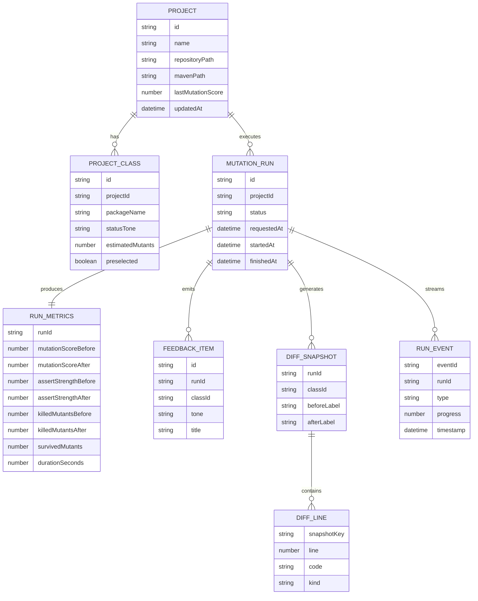
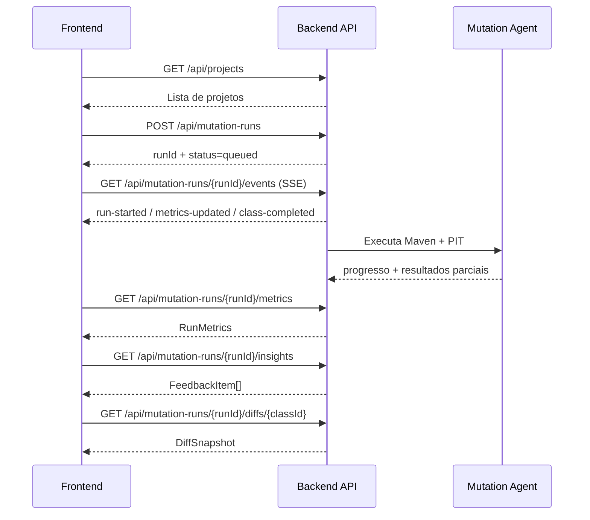

# Contrato de Dados Front <-> API (v1)

## 1) Objetivo
Este documento define o contrato de dados entre o frontend (Angular) e a API para suportar:
- selecao e gestao de multiplos projetos
- configuracao de execucao de mutation tests
- acompanhamento de run em tempo real
- visualizacao de metricas, feedback textual e diff

Escopo: contrato de payloads, endpoints, estados e eventos. Nao cobre detalhes de infraestrutura.

## 2) Convencoes Gerais
- Formato: `application/json`.
- Timezone em API: UTC (`YYYY-MM-DDTHH:mm:ss.sssZ`).
- Campos no padrao `camelCase`.
- IDs como string (`projectId`, `runId`, `classId`, `eventId`).
- Numeros de porcentagem no intervalo `0..100`.
- Moeda/locale: responsabilidade do frontend formatar para exibicao.

## 3) Envelope de Erro (padrao)
Todas as rotas REST devem responder erros neste formato:

```json
{
  "error": {
    "code": "PROJECT_NOT_FOUND",
    "message": "Projeto nao encontrado.",
    "details": {
      "projectId": "billing-core"
    },
    "traceId": "req-01J9XYZ..."
  }
}
```

## 4) Entidades de Dominio

### 4.1 Project
```json
{
  "id": "billing-core",
  "name": "Billing Core",
  "repositoryPath": "C:\\repos\\billing-core",
  "mavenPath": "C:\\tools\\apache-maven-3.9.9\\bin\\mvn.cmd",
  "lastMutationScore": 88,
  "updatedAt": "2026-03-25T18:35:12.000Z"
}
```

### 4.2 ProjectClass
```json
{
  "id": "UserServiceTest",
  "packageName": "com.company.user",
  "statusLabel": "Alta prioridade",
  "statusTone": "amber",
  "estimatedMutants": 14,
  "preselected": true
}
```

### 4.3 MutationRun
```json
{
  "id": "run_20260325_001",
  "projectId": "billing-core",
  "status": "running",
  "requestedAt": "2026-03-25T18:40:00.000Z",
  "startedAt": "2026-03-25T18:40:02.000Z",
  "finishedAt": null,
  "requestedBy": "carlos"
}
```

### 4.4 RunMetrics
```json
{
  "mutationScore": { "before": 74, "after": 88 },
  "assertStrength": { "before": 61, "after": 84 },
  "killedMutants": { "before": 48, "after": 79 },
  "survivedMutants": 6,
  "durationSeconds": 384
}
```

### 4.5 QualityInsightItem
```json
{
  "id": "fbk-01",
  "tone": "emerald",
  "title": "Regra de validacao reforcada",
  "detail": "Mutantes em validacao de email foram cobertos com asserts de borda.",
  "recommendation": "Manter padrao em novos fluxos de UserService.",
  "classId": "UserServiceTest"
}
```

### 4.6 DiffSnapshot
```json
{
  "classId": "UserServiceTest",
  "beforeLabel": "Antes - teste legado",
  "afterLabel": "Depois - teste revisado",
  "beforeLines": [
    { "line": 20, "code": "assertTrue(response.getBody().size() > 0);", "kind": "removed" }
  ],
  "afterLines": [
    { "line": 20, "code": "assertEquals(3, response.getBody().size());", "kind": "added" }
  ]
}
```

## 5) Enumeracoes

### 5.1 BadgeTone
- `soft-blue`
- `emerald`
- `amber`
- `muted`

### 5.2 RunStatus
- `queued`
- `running`
- `completed`
- `failed`
- `canceled`

### 5.3 DiffLineKind
- `context`
- `added`
- `removed`

### 5.4 EventType (SSE/WS)
- `run-queued`
- `run-started`
- `class-started`
- `class-completed`
- `metrics-updated`
- `feedback-updated`
- `diff-updated`
- `run-completed`
- `run-failed`
- `heartbeat`

## 6) Endpoints REST (v1)
Base URL sugerida: `/api`

## 6.1 Projetos

### GET /api/projects
Lista projetos cadastrados.

Response 200:
```json
{
  "items": [
    {
      "id": "billing-core",
      "name": "Billing Core",
      "repositoryPath": "C:\\repos\\billing-core",
      "mavenPath": "C:\\tools\\apache-maven-3.9.9\\bin\\mvn.cmd",
      "lastMutationScore": 88,
      "updatedAt": "2026-03-25T18:35:12.000Z"
    }
  ]
}
```

### POST /api/projects
Cria projeto.

Request:
```json
{
  "name": "Customer API",
  "repositoryPath": "C:\\repos\\customer-api",
  "mavenPath": "C:\\tools\\apache-maven-3.9.9\\bin\\mvn.cmd"
}
```

Response 201:
```json
{
  "id": "customer-api",
  "name": "Customer API",
  "repositoryPath": "C:\\repos\\customer-api",
  "mavenPath": "C:\\tools\\apache-maven-3.9.9\\bin\\mvn.cmd",
  "lastMutationScore": 0,
  "updatedAt": "2026-03-25T19:00:00.000Z"
}
```

### DELETE /api/projects/{projectId}
Remove projeto.

Response 204: sem corpo.

### GET /api/projects/{projectId}
Detalhes do projeto.

Response 200: objeto `Project`.

## 6.2 Maven

### POST /api/projects/{projectId}/detect-maven
Detecta Maven para o projeto.

Response 200:
```json
{
  "found": true,
  "path": "C:\\tools\\apache-maven-3.9.9\\bin\\mvn.cmd",
  "version": "3.9.9",
  "message": "Maven detectado automaticamente no ambiente local."
}
```

### POST /api/projects/{projectId}/validate-maven
Valida caminho Maven informado.

Request:
```json
{
  "mavenPath": "C:\\tools\\apache-maven-3.9.9\\bin\\mvn.cmd"
}
```

Response 200:
```json
{
  "valid": true,
  "version": "3.9.9",
  "message": "Maven executavel e valido."
}
```

## 6.3 Classes alvo

### GET /api/projects/{projectId}/classes
Lista classes que poderao entrar na rodada.

Response 200:
```json
{
  "items": [
    {
      "id": "UserServiceTest",
      "packageName": "com.company.user",
      "statusLabel": "Alta prioridade",
      "statusTone": "amber",
      "estimatedMutants": 14,
      "preselected": true
    }
  ]
}
```

## 6.4 Mutation Run

### POST /api/mutation-runs
Inicia uma rodada.

Request:
```json
{
  "projectId": "billing-core",
  "mavenPath": "C:\\tools\\apache-maven-3.9.9\\bin\\mvn.cmd",
  "classes": ["UserServiceTest", "PaymentValidatorTest"]
}
```

Response 201:
```json
{
  "id": "run_20260325_001",
  "projectId": "billing-core",
  "status": "queued",
  "requestedAt": "2026-03-25T19:05:00.000Z"
}
```

### GET /api/mutation-runs/{runId}
Resumo de status do run.

Response 200:
```json
{
  "id": "run_20260325_001",
  "projectId": "billing-core",
  "status": "running",
  "requestedAt": "2026-03-25T19:05:00.000Z",
  "startedAt": "2026-03-25T19:05:01.000Z",
  "finishedAt": null
}
```

### POST /api/mutation-runs/{runId}/cancel
Cancela run em andamento.

Response 202:
```json
{
  "id": "run_20260325_001",
  "status": "canceled"
}
```

## 6.5 Resultados do Run

### GET /api/mutation-runs/{runId}/metrics
Response 200: objeto `RunMetrics`.

### GET /api/mutation-runs/{runId}/insights
Response 200:
```json
{
  "items": [
    {
      "id": "fbk-01",
      "tone": "emerald",
      "title": "Regra de validacao reforcada",
      "detail": "Mutantes em validacao de email foram cobertos com asserts de borda.",
      "recommendation": "Manter padrao em novos fluxos de UserService.",
      "classId": "UserServiceTest"
    }
  ]
}
```

### GET /api/mutation-runs/{runId}/diffs
Lista diffs disponiveis.

Response 200:
```json
{
  "items": [
    {
      "classId": "UserServiceTest",
      "beforeLabel": "Antes - teste legado",
      "afterLabel": "Depois - teste revisado"
    }
  ]
}
```

### GET /api/mutation-runs/{runId}/diffs/{classId}
Response 200: objeto `DiffSnapshot` completo.

## 7) Stream de Eventos (SSE)

### GET /api/mutation-runs/{runId}/events
Headers:
- `Accept: text/event-stream`
- `Cache-Control: no-cache`

Formato SSE:
```text
event: metrics-updated
id: evt_000123
data: {"runId":"run_20260325_001","progress":42,"timestamp":"2026-03-25T19:06:10.000Z"}
```

Payload base para `data`:
```json
{
  "eventId": "evt_000123",
  "type": "metrics-updated",
  "runId": "run_20260325_001",
  "projectId": "billing-core",
  "progress": 42,
  "timestamp": "2026-03-25T19:06:10.000Z",
  "payload": {}
}
```

### 7.1 Payload por tipo de evento

`class-started`
```json
{
  "classId": "UserServiceTest",
  "index": 1,
  "total": 4
}
```

`class-completed`
```json
{
  "classId": "UserServiceTest",
  "killed": 12,
  "survived": 2
}
```

`metrics-updated`
```json
{
  "mutationScoreAfter": 82,
  "survivedMutants": 9
}
```

`run-failed`
```json
{
  "errorCode": "MAVEN_EXECUTION_FAILED",
  "message": "Falha ao executar comando Maven.",
  "retryable": true
}
```

## 8) Validacoes Minimas
- `project.name`: 3..80 chars.
- `project.repositoryPath`: obrigatorio, caminho absoluto.
- `project.mavenPath`: obrigatorio, caminho absoluto.
- `classes`: lista nao vazia em `POST /api/mutation-runs`.
- `runId` e `projectId` devem existir.
- `lastMutationScore`, metricas e progress sempre entre `0..100`.

## 9) Versionamento e Compatibilidade
- Prefixo recomendado: `/api/v1`.
- Campos novos devem ser adicionados sem quebrar os antigos.
- Remocao/renomeacao de campo exige nova versao (`v2`).
- Eventos SSE devem manter `type` estavel.

## 10) Diagrama ER (Dados principais)



## 11) Diagrama de Fluxo de Dados (Frontend x API)



## 12) Mapeamento Front (Tela) -> Endpoint
- Home de projetos: `GET/POST/DELETE /api/projects`.
- Stepper (Maven): `POST /api/projects/{projectId}/detect-maven` e `POST /validate-maven`.
- Classes alvo: `GET /api/projects/{projectId}/classes`.
- Iniciar run: `POST /api/mutation-runs`.
- Acompanhar run: `GET /api/mutation-runs/{runId}/events`.
- Metricas: `GET /api/mutation-runs/{runId}/metrics`.
- Analise textual: `GET /api/mutation-runs/{runId}/insights`.
- Diff: `GET /api/mutation-runs/{runId}/diffs/{classId}`.

## 13) Checklist de Implementacao
- Backend
1. Implementar rotas de projetos.
2. Implementar deteccao/validacao de Maven.
3. Implementar criacao de run e stream SSE.
4. Expor metricas, feedback e diff por `runId`.
5. Padronizar envelope de erro com `traceId`.

- Frontend
1. Substituir `StudioDataService` mock por `StudioApiService` HTTP.
2. Criar store para `selectedProject`, `runStatus`, `metrics`, `feedback`, `diff`.
3. Conectar Home de projetos com CRUD real.
4. Conectar Stepper com endpoints de Maven e classes.
5. Conectar workspace com SSE + fallback polling.

